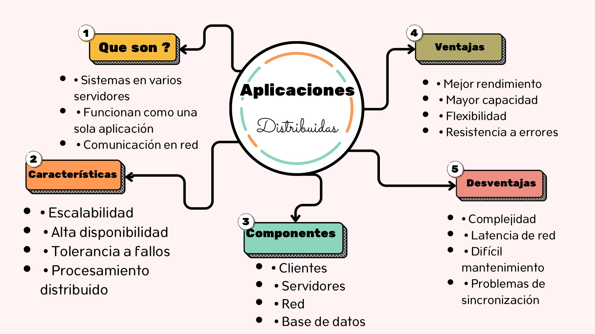
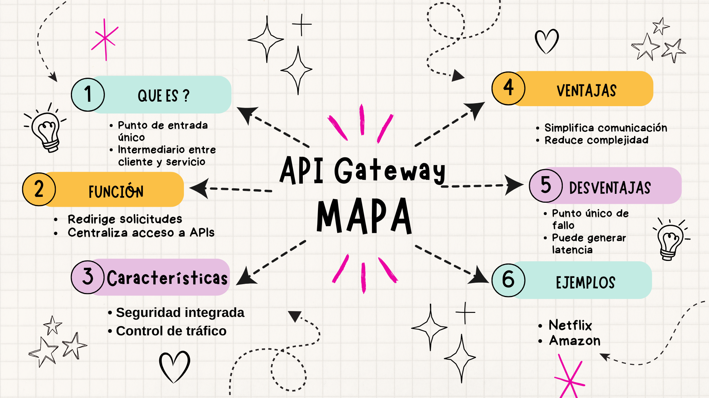
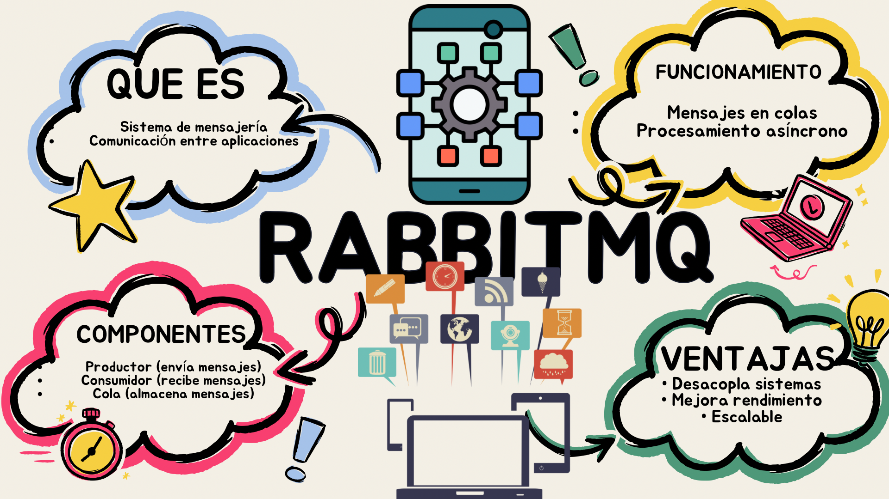
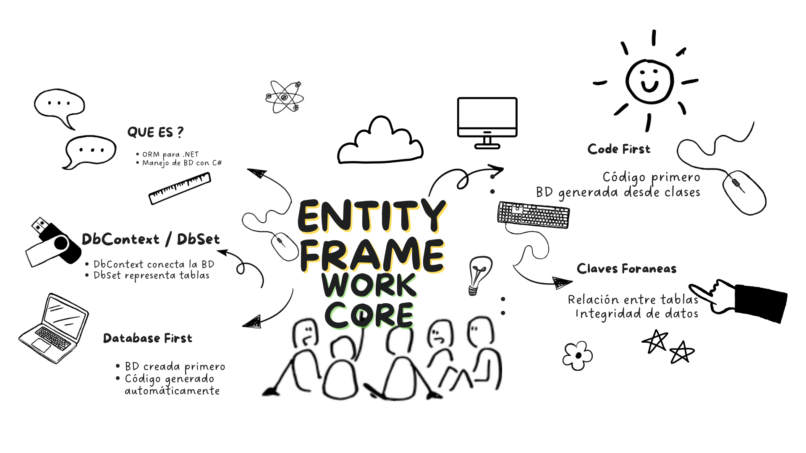
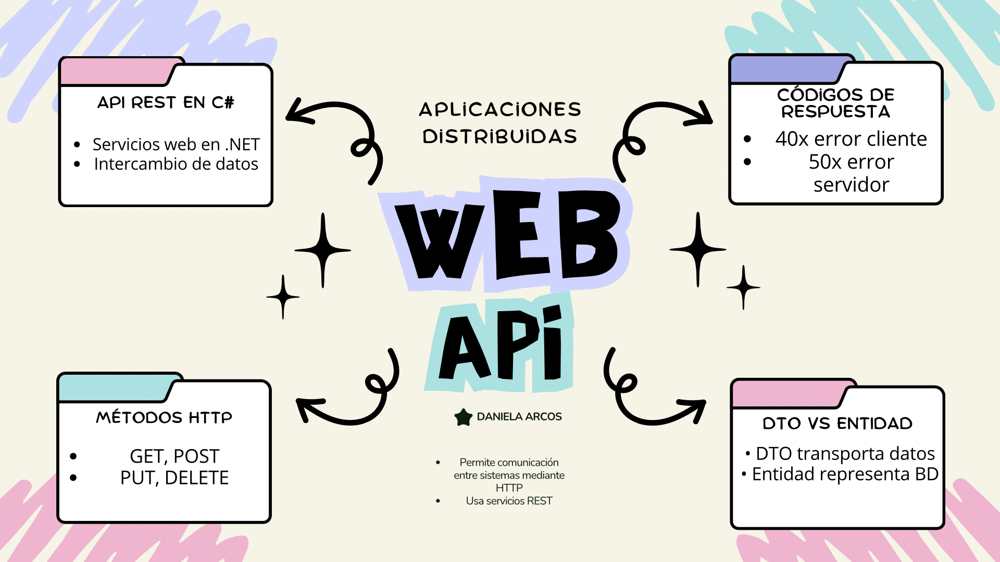
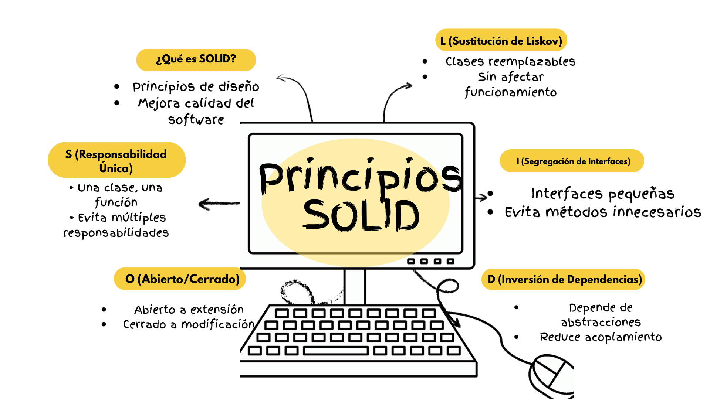
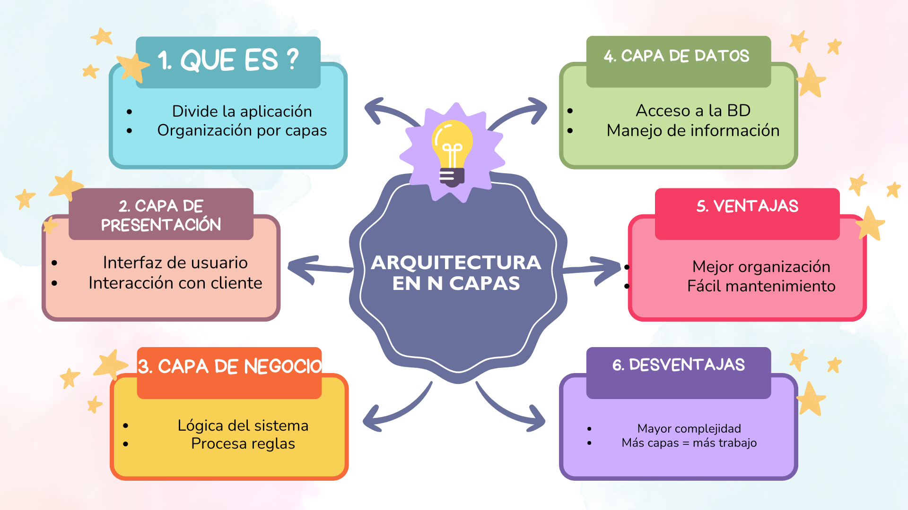
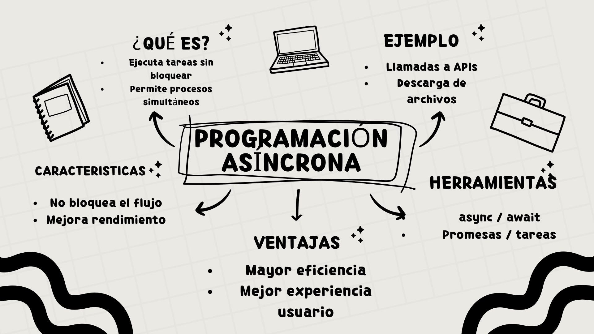
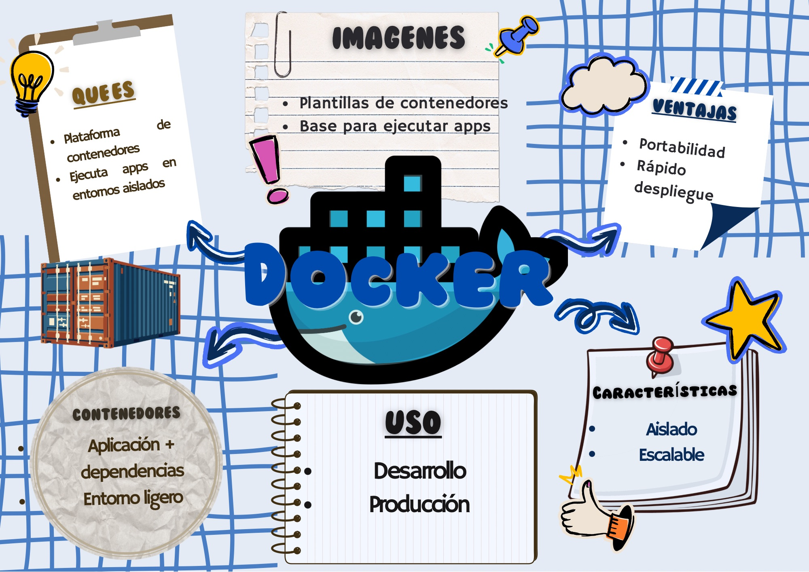
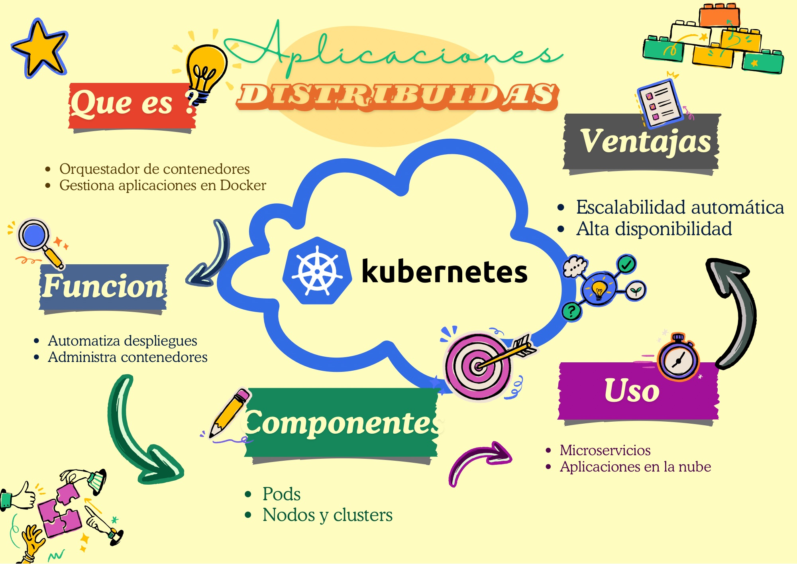

# Aplicaciones Distribuidas

## Mapas Mentales y Resúmenes

**Nombre Estudiante:** Danny Arcos  

---

##Introducción a Aplicaciones Distribuidas
**Resumen:**  
Son sistemas que funcionan en varios equipos pero actúan como uno solo, permitiendo escalabilidad y mejor rendimiento.

---

## API Gateway
**Resumen:**  
Es un punto de entrada único que gestiona las solicitudes hacia diferentes servicios.

---

## RabbitMQ
**Resumen:**  
Sistema de mensajería que permite comunicación entre aplicaciones mediante colas.

---

## Entity Framework Core
**Resumen:**  
ORM que permite trabajar con bases de datos usando C# sin escribir mucho SQL.

---

## Web API
**Resumen:**  
Permite crear servicios que se comunican mediante HTTP entre aplicaciones.

---

## Principios SOLID
**Resumen:**  
Conjunto de principios que ayudan a crear software limpio y mantenible.

---

## Arquitectura en N Capas
**Resumen:**  
Divide la aplicación en capas para mejorar organización y mantenimiento.

---

## Programación Asíncrona
**Resumen:**  
Permite ejecutar tareas sin bloquear el sistema.

---

##  Docker
**Resumen:**  
Herramienta para crear contenedores que ejecutan aplicaciones en cualquier entorno.

---

## Kubernetes
**Resumen:**  
Plataforma que gestiona contenedores y automatiza su despliegue.

---

## ✅ Conclusión
Este trabajo permitió entender cómo funcionan las aplicaciones modernas, su estructura y las herramientas necesarias para su desarrollo y despliegue.

---

## 🔗 Links de apoyo
- https://www.netmentor.es/
- https://learn.microsoft.com/
- https://docs.docker.com/
- https://kubernetes.io/docs/
